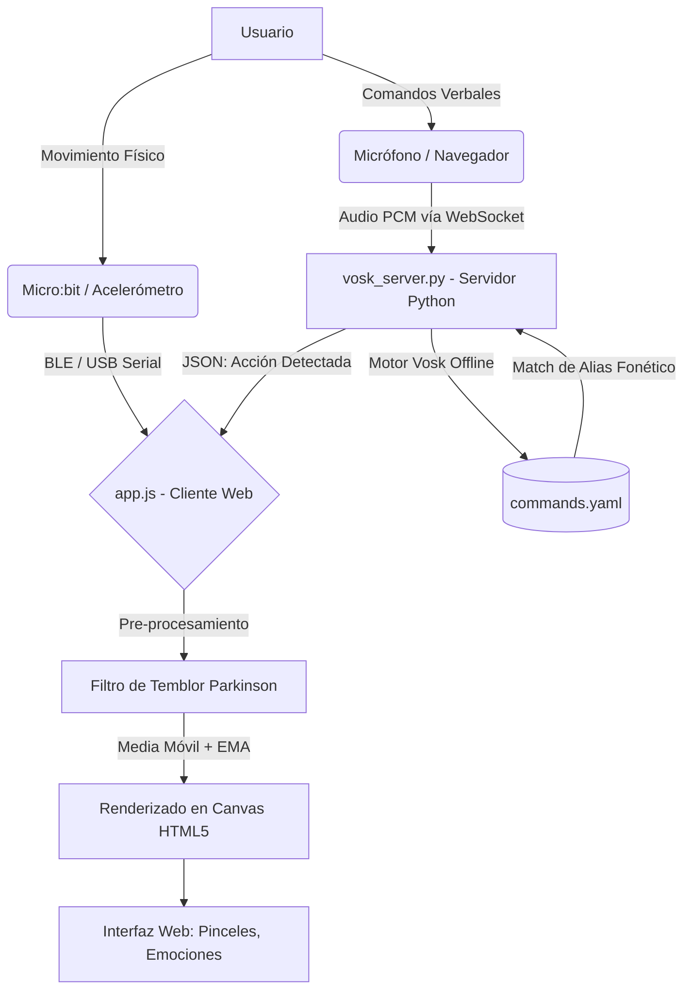

# Documentacion del Proyecto: AirPaint (Lienzo Guiado por Micro:bit)

Este documento centraliza el diseno de software, la configuracion del hardware, las instrucciones de puesta en marcha y el control de versiones para el sistema **AirPaint**. Puede ser editado y actualizado en cada cambio de version o ajuste del sistema.

---

## Indice
1. [Descripcion General y Arquitectura](#descripcion-general-y-arquitectura)
2. [Estructura del Proyecto](#estructura-del-proyecto)
3. [Guia de Configuracion Centralizada (config.json)](#guia-de-configuracion-centralizada-configjson)
4. [Hardware y Conectividad (Glove Design)](#hardware-y-conectividad-glove-design)
5. [Firmware del Micro:bit](#firmware-del-microbit)
6. [Pinceles Artisticos](#pinceles-artisticos)
7. [Modo Emociones del Dibujante](#modo-emociones-del-dibujante)
8. [Comandos de Voz (Vosk)](#comandos-de-voz-vosk)
9. [Filtro de Temblor (Perfil Parkinson)](#filtro-de-temblor-perfil-parkinson)
10. [Algoritmo de Reconocimiento de Gestos (DTW)](#algoritmo-de-reconocimiento-de-gestos-dtw)
11. [Guia de Instalacion y Ejecucion](#guia-de-instalacion-y-ejecucion)
12. [Registro de Versiones](#registro-de-versiones)

---

## Descripcion General y Arquitectura

**AirPaint** es una aplicacion web interactiva disenada para que ninas y ninos puedan dibujar en un lienzo digital mediante el movimiento fisico de su mano en el mundo real o usando su voz.

### Diagrama de Flujo del Sistema



El hardware del sistema consiste en una tarjeta **BBC Micro:bit** montada en un guante. Esta tarjeta lee datos de su acelerometro y estado de botones en tiempo real, transmitiendo las coordenadas mediante **Bluetooth de Baja Energia (BLE)** o **USB Serie** a una computadora. Alternativamente, los usuarios pueden usar **Comandos de Voz** para controlar el dibujo.

El sistema incluye:
- **8 pinceles artisticos** (Normal, Neon, Acuarela, Crayon, Spray, Puntillismo, Estrellas, Espejo)
- **Modo Emociones**: detecta la fuerza/velocidad del trazo y cambia automaticamente el color y grosor
- **Reconocimiento de gestos (DTW)**: permite activar comandos gesticulando en el aire
- **Configuracion centralizada** desde `config.json` para editar facilmente nombre, autoras, colores y mas

---

## Estructura del Proyecto

```text
Art-microbit/
├── config.json          # Configuracion centralizada (nombre, autoras, colores, parametros)
├── index.html           # Interfaz web infantil (Lienzo, Telemetria, Emociones, Gestos, Voz, Parkinson)
├── style.css            # Estilos CSS con tema infantil y paneles de control
├── app.js               # Logica de dibujo, pinceles, Web Bluetooth, DTW, WebSocket de Voz y Filtro Parkinson
├── server.js            # Servidor local Node.js para frontend
├── vosk_server.py       # Servidor Python de reconocimiento de voz offline
├── commands.yaml        # Diccionario de comandos de voz y alias foneticos
├── inicio.bat           # Activador: instala dependencias e inicia ambos servidores automaticamente
├── package.json         # Metadatos del proyecto Node.js
└── DOCUMENTACION.md     # Este archivo
```

---

## Guia de Configuracion Centralizada (`config.json`)

Todas las variables del sistema estan en `config.json`. Puedes editarlas sin tocar el codigo:

### Seccion `app` (Datos del Programa)

| Variable | Tipo | Descripcion |
| :--- | :--- | :--- |
| `app.name` | String | Nombre de la aplicacion que aparece en el header |
| `app.subtitle` | String | Subtitulo debajo del nombre |
| `app.version` | String | Version visible (ej: "v1.0") |
| `app.badge` | String | Texto de la insignia junto al nombre |
| `app.authors` | Array | Lista de nombres de las autoras del proyecto |
| `app.school` | String | Nombre del colegio o institucion |
| `app.year` | String | Ano del proyecto |

### Seccion `drawing` (Configuracion del Lienzo)

| Variable | Tipo | Descripcion |
| :--- | :--- | :--- |
| `drawing.defaultColor` | String | Color hexadecimal inicial del pincel |
| `drawing.defaultWidth` | Entero | Grosor del pincel en pixeles al iniciar |
| `drawing.smoothingFactor` | Float | Suavizado del cursor (`0.01` a `0.5`). Menor = mas suave |
| `drawing.sensitivityX` / `Y` | Float | Multiplicador de velocidad del cursor |
| `drawing.tiltThreshold` | Entero | Zona muerta en mg para evitar deriva por temblor |

### Seccion `patterns` (Gestos)

| Variable | Tipo | Descripcion |
| :--- | :--- | :--- |
| `patterns.recordingDurationMs` | Entero | Duracion de grabacion de un gesto (ms) |
| `patterns.dtwThreshold` | Float | Tolerancia DTW. Menor = gestos mas precisos |
| `patterns.actionMappings` | Array | Lista de gestos con nombre, accion y etiqueta |

### Seccion `ui` (Colores y Tema)

| Variable | Tipo | Descripcion |
| :--- | :--- | :--- |
| `ui.theme` | String | Tema visual ("kids-colorful") |
| `ui.availableColors` | Array | Paleta de colores disponibles para pintar |

---

## Hardware y Conectividad (Glove Design)

### Metodos de Conexion
1. **Inalambrico (BLE)**: Comodo y sin cables. Requiere Bluetooth en la PC.
2. **Cable USB (Web Serial)**: Muy estable, baja latencia. Ideal si no hay Bluetooth.

### Montaje del Guante
1. Coloca la Micro:bit horizontal y firme sobre el dorso de un guante textil.
2. La pantalla LED (5x5) debe quedar mirando hacia arriba con la mano extendida.
3. **Orientacion**:
   - Eje X: hacia la derecha (dedo indice)
   - Eje Y: hacia adelante (puntas de los dedos)
   - Eje Z: verticalmente hacia arriba

### Controles del Guante
| Boton | Accion |
| :--- | :--- |
| **Boton A (mantener)** | Activa el pincel: mientras se mantiene presionado, dibuja en el lienzo. Al soltar, levanta el pincel. El dibujo **NO se borra** al soltar. |
| **Boton B (presionar)** | Calibracion: guarda la posicion actual del acelerometro como punto cero (0,0) y centra el cursor en el medio del lienzo. Tiene debounce de 1.5 segundos para evitar recalibraciones accidentales. |
| **Boton Limpiar (UI)** | Unica forma de borrar el lienzo completo. |

---

## Firmware del Micro:bit

Los codigos envian datos **simultaneamente por USB y BLE**. Puedes alternar el tipo de conexion sin cambiar de programa.

### Opcion A: MakeCode Python (Recomendado)
Copia este codigo en la seccion **Python** del editor de [MakeCode](https://makecode.microbit.org/):

```python
conectado = False

def on_bluetooth_connected():
    global conectado
    conectado = True
    basic.show_icon(IconNames.HAPPY)

def on_bluetooth_disconnected():
    global conectado
    conectado = False
    basic.show_icon(IconNames.ASLEEP)

bluetooth.on_bluetooth_connected(on_bluetooth_connected)
bluetooth.on_bluetooth_disconnected(on_bluetooth_disconnected)

bluetooth.start_uart_service()
basic.show_icon(IconNames.ASLEEP)

def on_forever():
    x = input.acceleration(Dimension.X)
    y = input.acceleration(Dimension.Y)
    z = input.acceleration(Dimension.Z)

    btn_a = 1 if input.button_is_pressed(Button.A) else 0
    btn_b = 1 if input.button_is_pressed(Button.B) else 0

    msg = "" + str(x) + "," + str(y) + "," + str(z) + "," + str(btn_a) + "," + str(btn_b)

    serial.write_line(msg)

    if conectado:
        bluetooth.uart_write_line(msg)

    basic.pause(30)

basic.forever(on_forever)
```

### Opcion B: MicroPython Estandar

```python
from microbit import *
import bluetooth

uart = bluetooth.Uart()
uart.start()
display.show(Image.ASLEEP)

while True:
    x = accelerometer.get_x()
    y = accelerometer.get_y()
    z = accelerometer.get_z()
    btn_a = 1 if button_a.is_pressed() else 0
    btn_b = 1 if button_b.is_pressed() else 0

    msg = "{},{},{},{},{}".format(x, y, z, btn_a, btn_b)
    print(msg)

    if uart.is_connected():
        display.show(Image.HAPPY)
        uart.send(msg + "\n")
    else:
        display.show(Image.ASLEEP)

    sleep(30)
```

### Opcion C: MakeCode JavaScript

```javascript
let conectado = false
bluetooth.onBluetoothConnected(function () {
    conectado = true
    basic.showIcon(IconNames.Happy)
})
bluetooth.onBluetoothDisconnected(function () {
    conectado = false
    basic.showIcon(IconNames.Asleep)
})
bluetooth.startUartService()
basic.showIcon(IconNames.Asleep)

basic.forever(function () {
    let x = input.acceleration(Dimension.X)
    let y = input.acceleration(Dimension.Y)
    let z = input.acceleration(Dimension.Z)
    let btnA = input.buttonIsPressed(Button.A) ? 1 : 0
    let btnB = input.buttonIsPressed(Button.B) ? 1 : 0

    let msg = x + "," + y + "," + z + "," + btnA + "," + btnB
    serial.writeLine(msg)

    if (conectado) {
        bluetooth.uartWriteLine(msg)
    }
    basic.pause(30)
})
```

---

## Pinceles Artisticos

La aplicacion incluye 8 tipos de pincel para crear diferentes estilos de obra:

| Pincel | Descripcion | Ideal para |
| :--- | :--- | :--- |
| **Normal** | Linea solida y limpia con bordes redondeados | Dibujo libre, escritura |
| **Brillo Neon** | Resplandor luminoso con halo de color + centro blanco | Arte futurista, letreros |
| **Acuarela** | Manchas translucidas superpuestas con opacidad baja | Paisajes, fondos suaves |
| **Crayon** | Trazos irregulares con textura rugosa variable | Arte infantil, bocetos |
| **Spray / Aerosol** | Particulas dispersas como lata de pintura | Graffiti, texturas |
| **Puntillismo** | Puntos solidos individuales (estilo Seurat) | Arte puntillista |
| **Estrellas** | Estampa estrellitas de 5 puntas al mover | Decoracion, cielos |
| **Espejo (Simetria)** | Todo lo que dibujas se refleja horizontalmente | Mandalas, mariposas |

Los pinceles se seleccionan desde el panel lateral en **"Efecto especial"**. Cada pincel funciona tanto con la Micro:bit como con el modo raton de simulacion.

---

## Modo Emociones del Dibujante

Esta funcionalidad unica detecta la **velocidad y fuerza** del movimiento del cursor y cambia automaticamente el color y grosor del trazo:

| Velocidad | Emocion | Color | Grosor |
| :--- | :--- | :--- | :--- |
| Lenta y suave | Tranquilidad | Azul | Fino (5px) |
| Media / dinamica | Alegria | Amarillo | Medio (15px) |
| Rapida y brusca | Energia Alta | Rojo | Grueso (maximo) |

### Como activarlo
1. En el panel lateral, busca la tarjeta **"Emociones del Dibujante"**
2. Activa el interruptor **"Activar Modo Emociones"**
3. Dibuja normalmente. El indicador de estado cambiara en tiempo real mostrando la emocion detectada

### Nota tecnica
La deteccion se basa en la velocidad instantanea del cursor (`speed = sqrt(dx^2 + dy^2)`) calculada frame a frame. Los umbrales son: `>15px/frame` = Energia, `>4px/frame` = Alegria, resto = Tranquilidad.

---

## Comandos de Voz (Vosk)

El sistema integra un motor de reconocimiento de voz **offline** (Vosk) para garantizar la privacidad y baja latencia sin requerir internet.

### Archivo `commands.yaml`
Todos los comandos están indexados en este archivo y separados por categorias. Incluye soporte para multiples *alias foneticos* (por ejemplo, reconocer "berde" en lugar de "verde" por errores de pronunciacion).
- **Colores**: rojo, rosa, morado, verde, amarillo, azul, naranja, blanco, negro
- **Pinceles**: normal, neón, acuarela, crayón, spray, puntos, estrellas, espejo
- **Funciones**: empezar a pintar, dejar de pintar, limpiar, calibrar, grosor, guardar
- **Perfiles Parkinson**: leve, moderado, severo, sin filtro

Para agregar un comando nuevo, basta con editar el archivo `commands.yaml`. No es necesario modificar Python o JavaScript.

---

## Filtro de Temblor (Perfil Parkinson)

El sistema incluye un algoritmo de estabilizacion de tres capas para asistir a personas con movimientos involuntarios (temblores por mal de Parkinson, etc.):

1. **Filtro de Frecuencia (Media Móvil)**: Suaviza las muestras mas recientes para rechazar oscilaciones rapidas cortas.
2. **Zona Muerta Expandida**: Ignora micro-movimientos por debajo de un umbral en mg de fuerza G.
3. **Suavizado EMA Adaptativo**: Reduce la velocidad de aceleracion del cursor en pantalla.

Los perfiles se pueden seleccionar desde la interfaz grafica o por comandos de voz:
- ⚪ **Sin filtro**: Respuesta rapida, comportamiento normal.
- 🟢 **Leve**: Zona muerta de 30mg, suavizado ligero.
- 🟡 **Moderado**: Zona muerta de 80mg, suavizado notable.
- 🔴 **Severo**: Zona muerta de 150mg, maxima reduccion de vibracion.
- 🔧 **Personalizado**: Sliders manuales en la interfaz.

---

## Algoritmo de Reconocimiento de Gestos (DTW)

### Normalizacion de secuencias
Para que un gesto sea reconocido independientemente de donde y a que tamano se dibuje:
1. **Invarianza de Traduccion**: Se calcula el centroide y se resta a cada punto
2. **Invarianza de Escala**: Se divide por la distancia maxima al centroide

### Comparacion DTW (Dynamic Time Warping)
DTW alinea de forma no lineal los ejes temporales para encontrar la minima distancia de deformacion. El sistema compara la ventana de movimiento (cuando el pincel esta levantado) con los patrones almacenados en `localStorage`.

### Protecciones anti-borrado
- Al soltar el boton A, el buffer de gestos (`rollingWindow`) se limpia automaticamente para evitar que los trazos de dibujo se confundan con un gesto "clear"
- Cooldown de 2 segundos entre reconocimientos para evitar disparos repetitivos

---

## Guia de Instalacion y Ejecucion

La aplicacion consta de **dos servidores locales**: un servidor web estatico (Node.js) para la interfaz y Web Bluetooth, y un servidor WebSocket de voz (Python).

### 1. Requisitos Previos e Instalación

**Node.js (Frontend)**
1. Descarga e instala [Node.js](https://nodejs.org/).
2. **¡Importante!** Si acabas de instalar Node.js en Windows, **debes reiniciar tu computadora** o al menos cerrar y volver a abrir tu explorador de archivos y terminales para que Windows actualice las variables de entorno (el PATH). Si no reinicias, el archivo `inicio.bat` podria decir que Node.js no esta instalado.

**Python (Voz)**
1. Descarga e instala [Python 3](https://python.org/). En el instalador, marca la casilla **"Add Python to PATH"**.
2. Al ejecutar el sistema por primera vez, se auto-instalaran las dependencias (`vosk`, `websockets`, `pyyaml`).
3. Asegurate de tener la carpeta del modelo de voz (`vosk-model-small-es-0.42`) extraida en la raiz del proyecto.

### 2. Ejecutar el Proyecto (Metodo Rapido)

1. Haz **doble clic** en el archivo `inicio.bat`.
2. El script revisará si tienes Node.js y Python.
3. Instalara las dependencias si faltan.
4. Iniciará el **servidor de voz (puerto 2700)** en segundo plano.
5. Iniciará el **servidor web (puerto 5000)** y abrira tu navegador en `http://localhost:5000`.

### Problemas Frecuentes (Troubleshooting)

- **"Node.js no está instalado" aunque ya lo instalé:**
  Asegurate de haber reiniciado tu computadora despues de la instalacion. El script necesita encontrar el comando `node` en el sistema.
- **La voz no reconoce mis comandos:**
  Revisa en la consola que diga "Modelo Vosk cargado". Asegurate de darle permisos de microfono a la pagina en tu navegador y de activar el switch de "Activar Microfono" en la interfaz.
- **No detecta la Micro:bit por Bluetooth:**
  Chrome/Edge en Windows requiere emparejar primero o tener soporte nativo de Web Bluetooth activado en `chrome://flags/#enable-web-bluetooth`. Recomendamos la opcion de "Conectar USB" si presentas inestabilidad.

---

### Modo Simulacion (Sin Micro:bit)
Si no tienes una Micro:bit conectada, puedes probar toda la funcionalidad activando el **Modo Raton** en el panel de Sensor. Esto permite:
- Mover el cursor con el raton sobre el lienzo
- Dibujar haciendo clic sostenido
- Usar el microfono para probar los comandos de voz
- Probar todos los pinceles y el modo emociones

---

## Registro de Versiones

| Version | Fecha | Cambios Realizados |
| :--- | :--- | :--- |
| **v1.0.0** | 2026-05-20 | Estructura inicial. Config centralizada. Lienzo con suavizado EMA. Web Bluetooth UART. Motor de gestos DTW. Servidor local sin dependencias. |
| **v1.1.0** | 2026-05-20 | Soporte USB via Web Serial API. Firmware dual (USB + BLE simultaneo). |
| **v2.0.0** | 2026-06-02 | **Rediseno completo infantil**. Config.json ampliado. **8 pinceles artisticos**. **Modo Emociones del Dibujante**. **Archivo inicio.bat**. Correccion de borrado del canvas y calibracion mejorada. |
| **v3.0.0** | 2026-06-03 | **Integración de Comandos de Voz** offline con motor Vosk Python (`commands.yaml`). **Filtro Temblor Parkinson** de 3 capas con perfiles asisitidos. Guía de instalación y arquitectura extendida. |
