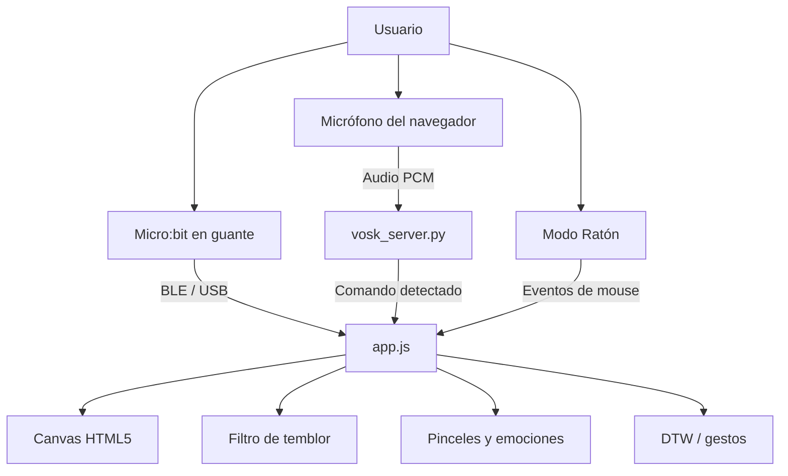

# MirrorGlove

**Arte con Micro:bit, voz offline y pinceles creativos para dibujar con movimiento.**

MirrorGlove es una aplicación web interactiva para controlar un lienzo digital con una BBC Micro:bit colocada en un guante, usando el acelerómetro, los botones físicos y comandos de voz en español. El proyecto combina una interfaz infantil y colorida con herramientas de accesibilidad, filtros de estabilización y reconocimiento de gestos.

> También conocido como la evolución de **AirPaint**: un lienzo guiado por Micro:bit con soporte para voz, simulación con mouse y perfiles de asistencia.

---

## ✨ Lo que hace especial a este proyecto

- Dibujo en tiempo real con **Micro:bit** por **Bluetooth** o **USB**.
- **8 pinceles artísticos**: normal, neón, acuarela, crayón, spray, puntillismo, estrellas y espejo.
- **Modo Emociones**: adapta color y grosor según la energía del trazo.
- **Comandos de voz offline** con **Vosk** y `commands.yaml`.
- **Filtro de temblor** con perfiles de asistencia para suavizar el movimiento.
- **Reconocimiento de gestos DTW** para activar acciones personalizadas.
- **Modo Ratón** para probar todo sin hardware.
- **Configuración centralizada** desde `config.json`.

---

## 🧭 Vista general



---

## 🧱 Arquitectura del proyecto

| Archivo | Función |
|---|---|
| [index.html](index.html) | Interfaz principal: lienzo, controles, paneles y tarjetas.
| [style.css](style.css) | Diseño visual, animaciones y tema infantil/colorido.
| [app.js](app.js) | Lógica principal del frontend: conexión, dibujo, pinceles, voz, DTW y filtros.
| [server.js](server.js) | Servidor HTTP local para abrir la app en `http://localhost:5000`.
| [vosk_server.py](vosk_server.py) | Servidor WebSocket de voz offline con Vosk.
| [commands.yaml](commands.yaml) | Catálogo de comandos de voz y aliases fonéticos.
| [config.json](config.json) | Configuración centralizada de la app.
| [inicio.bat](inicio.bat) | Arranque rápido en Windows: valida requisitos e inicia servicios.
| [Micro-Art.hex](Micro-Art.hex) | Firmware listo para cargar en la Micro:bit.

---

## 🖼️ Interfaz

La interfaz está pensada para ser clara, alegre y fácil de usar:

- Encabezado con estado de conexión.
- Lienzo central para dibujar.
- Panel lateral con colores, pinceles, gestos y ajustes.
- Indicadores visuales para coordenadas, emociones, simulación y botones.
- Soporte para activar o desactivar microfono, conexión y herramientas en vivo.

---

## 🚀 Inicio rápido

### Opción recomendada en Windows

1. Asegúrate de tener instalado **Node.js**.
2. Asegúrate de tener instalado **Python 3**.
3. Haz doble clic en [inicio.bat](inicio.bat).
4. El script:
   - verifica Node.js,
   - verifica Python,
   - instala dependencias Python si hacen falta,
   - inicia el servidor de voz en el puerto `2700`,
   - inicia el servidor web en el puerto `5000`,
   - abre el navegador automáticamente.

### Opción manual

```bash
npm start
```

Eso levanta el servidor web local. Si vas a usar voz offline, también ejecuta:

```bash
python vosk_server.py
```

---

## 🧩 Requisitos

- **Windows 10/11** recomendado para la experiencia completa.
- **Node.js** para el servidor local.
- **Python 3** para el motor de voz.
- Navegador compatible con **Web Bluetooth** y acceso a **micrófono**.
- Una **BBC Micro:bit** con firmware cargado, si quieres usar hardware real.
- La carpeta del modelo de voz debe estar presente: `vosk-model-small-es-0.42/`.

---

## 🎮 Formas de uso

### 1. Con Micro:bit

- Conecta la placa por Bluetooth o USB.
- Coloca la Micro:bit en el guante según la orientación del proyecto.
- Mantén presionado el botón A para dibujar.
- Usa el botón B para calibrar.

### 2. Con comandos de voz

- Activa el micrófono en la interfaz.
- Habla uno de los comandos definidos en `commands.yaml`.
- El servidor Vosk detectará la intención y ejecutará la acción.

### 3. Sin hardware

- Activa el **Modo Ratón**.
- Usa el mouse para simular el movimiento.
- Prueba pinceles, emociones, voz y gestos sin conectar la Micro:bit.

---

## 🖌️ Pinceles artísticos

| Pincel | Estilo |
|---|---|
| Normal | Trazos limpios y continuos.
| Neón | Efecto luminoso tipo resplandor.
| Acuarela | Trazos suaves y translúcidos.
| Crayón | Textura irregular e infantil.
| Spray | Partículas dispersas tipo aerosol.
| Puntillismo | Puntos individuales sobre el lienzo.
| Estrellas | Estrellas decorativas al mover.
| Espejo | Simetría horizontal automática.

---

## 🧠 Modo Emociones

Este modo analiza la velocidad del trazo para cambiar automáticamente el aspecto del dibujo:

| Movimiento | Emoción | Resultado |
|---|---|---|
| Suave | Tranquilidad | Color azul y grosor fino.
| Medio | Alegría | Color amarillo y grosor intermedio.
| Rápido | Energía | Color rojo y grosor más grueso.

---

## 🎤 Voz offline con Vosk

La carpeta [commands.yaml](commands.yaml) contiene los comandos hablados organizados por categorías:

- Colores
- Pinceles
- Funciones
- Perfiles de asistencia

El servidor [vosk_server.py](vosk_server.py) escucha el audio PCM del navegador, reconoce el texto y busca coincidencias con los aliases de voz.

### Comandos típicos

- cambiar color
- limpiar lienzo
- pincel neón
- pincel acuarela
- modo normal
- activar filtro leve
- desactivar filtro

Si quieres añadir más comandos, normalmente solo necesitas editar [commands.yaml](commands.yaml).

---

## 🩺 Filtro de asistencia

MirrorGlove incluye un filtro orientado a personas con temblor o movimientos involuntarios. El sistema suaviza la entrada en varias capas para reducir vibración y ruido del gesto.

| Perfil | Descripción |
|---|---|
| Sin filtro | Respuesta directa.
| Leve | Suavizado ligero.
| Moderado | Filtrado notable.
| Severo | Máxima estabilización.
| Personalizado | Ajustes manuales.

---

## 🧪 Reconocimiento de gestos DTW

El proyecto puede grabar secuencias de movimiento y compararlas con patrones guardados usando DTW (Dynamic Time Warping). Esto permite asociar gestos a acciones como limpiar el lienzo, cambiar de color o alternar modos.

Flujo general:

1. Se registra el gesto.
2. Se normaliza la secuencia.
3. Se compara con patrones guardados.
4. Si supera el umbral, se dispara la acción correspondiente.

---

## ⚙️ Configuración

La mayor parte de los ajustes visuales y técnicos vive en [config.json](config.json):

- nombre y subtítulo de la app,
- autores y escuela,
- color y grosor inicial,
- sensibilidad y suavizado,
- umbrales de reconocimiento,
- paleta de colores disponibles,
- mapeo de acciones de gestos.

Eso permite ajustar la experiencia sin tocar el núcleo del código.

---

## 📁 Estructura resumida

```text
Art-microbitv2/
├── app.js
├── commands.yaml
├── config.json
├── DOCUMENTACION.md
├── GUIA_NINAS.md
├── index.html
├── inicio.bat
├── Micro-Art.hex
├── package.json
├── README.md
├── server.js
├── style.css
├── vosk_server.py
└── vosk-model-small-es-0.42/
```

---

## 🛠️ Desarrollo local

### Servidor web

```bash
npm start
```

### Servidor de voz

```bash
python vosk_server.py
```

### Puertos usados

- `5000` para la interfaz web local.
- `2700` para el servidor WebSocket de voz.

---

## 🔍 Solución de problemas

### No abre la app

- Verifica que Node.js esté instalado.
- Reinicia la terminal o la PC después de instalarlo en Windows.

### La voz no responde

- Revisa permisos de micrófono en el navegador.
- Confirma que `vosk_server.py` esté corriendo.
- Verifica que el modelo `vosk-model-small-es-0.42/` exista en la raíz.

### La Micro:bit no conecta

- Asegúrate de estar en un navegador compatible con Web Bluetooth.
- Prueba conexión USB si Bluetooth es inestable.
- Recalibra con el botón B.

### Cambios raros en archivos YAML o BAT

- Si trabajas en Windows, Git puede convertir saltos de línea entre LF y CRLF.
- Eso no rompe el código, pero puede generar avisos al hacer commit.

---

## 👩‍🎓 Créditos

- **Sofía Rodríguez**
- **Wilmary León**
- **Verónica Brito**
- **U.E. Doña Menca de Leoni**

---

## 📄 Licencia

Según [package.json](package.json), el proyecto está bajo licencia **MIT**.

---

## 💡 Nota final

Si quieres seguir mejorando el proyecto, una buena siguiente tarea es añadir capturas de pantalla reales, un gif corto del lienzo y una tabla de comandos de voz más compacta para uso rápido.