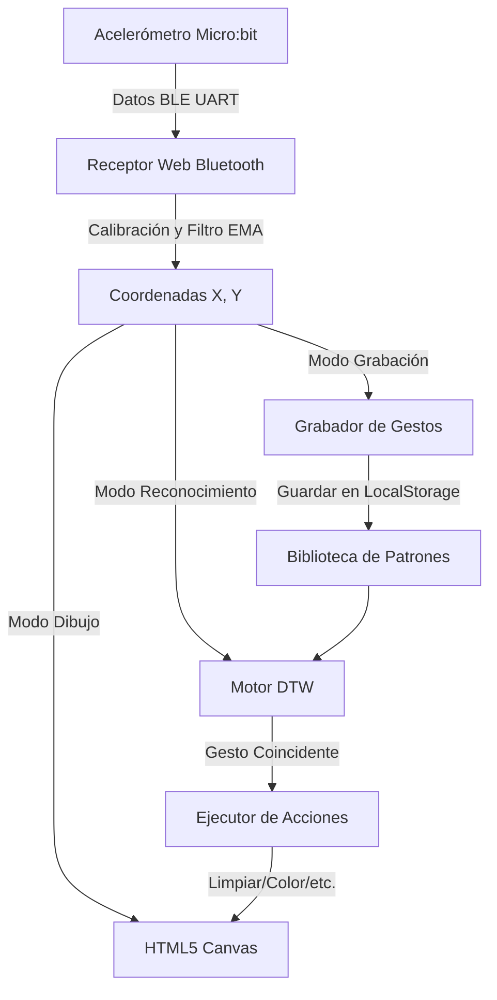

# Plan de Implementación: Lienzo de Dibujo Controlado por Micro:bit y Reconocimiento de Patrones

Este documento describe el plan de diseño e implementación de un sistema interactivo de dibujo guiado por gestos a través de una placa BBC Micro:bit colocada en un guante, transmitiendo datos de acelerómetro/giroscopio en tiempo real por Bluetooth de baja energía (BLE) a una interfaz web premium.

---

## Diseño del Sistema

El sistema estará compuesto por los siguientes componentes clave:
1. **Firmware Micro:bit**: Código (MicroPython y MakeCode) que transmite las lecturas del sensor del Micro:bit (aceleración X, Y, Z y clics de botones) en formato estructurado a través del servicio UART de Nordic (BLE).
2. **Archivo de Configuración (`config.json`)**: Un archivo JSON centralizado que almacena todas las variables de configuración del sistema (UUIDs de Bluetooth, factores de suavizado, sensibilidad, parámetros de pincel y configuraciones del algoritmo de reconocimiento).
3. **Frontend (Vite + Vanilla JS)**: Una aplicación web con una estética visual premium (modo oscuro, efectos de desenfoque de fondo/glassmorphism, animaciones fluidas y controles intuitivos) que incluye:
   - **Lienzo de Dibujo (HTML5 Canvas)**: Dibuja trazos basados en el movimiento de la mano.
   - **Gestión de Conexión BLE**: Conecta el Micro:bit directamente a través de Web Bluetooth.
   - **Módulo de Calibración**: Establece el punto neutral de reposo del guante para corregir sesgos físicos.
   - **Muestreo y Grabación de Movimientos**: Permite registrar gestos en tiempo real y visualizarlos en un gráfico secundario.
   - **Motor de Reconocimiento (DTW)**: Ejecuta un algoritmo de *Dynamic Time Warping* para comparar gestos en vivo con los patrones guardados y activar acciones personalizadas (por ejemplo, cambiar de color, limpiar lienzo o levantar el lápiz).
4. **Documentación del Proyecto (`DOCUMENTACION.md`)**: Archivo local detallado que servirá como registro histórico de versiones, dependencias y guía paso a paso de uso.

---

## Archivo de Configuración Centralizado (`config.json`)

El archivo de variables se estructurará de la siguiente forma:

```json
{
  "bluetooth": {
    "serviceUuid": "6e400001-b5a3-f393-e0a9-e50e24dcca9e",
    "txCharacteristicUuid": "6e400003-b5a3-f393-e0a9-e50e24dcca9e",
    "rxCharacteristicUuid": "6e400002-b5a3-f393-e0a9-e50e24dcca9e",
    "reconnectIntervalMs": 3000
  },
  "drawing": {
    "defaultColor": "#a855f7",
    "defaultWidth": 5,
    "minWidth": 1,
    "maxWidth": 50,
    "canvasWidth": 1200,
    "canvasHeight": 800,
    "smoothingFactor": 0.15,
    "sensitivityX": 2.5,
    "sensitivityY": 2.5,
    "tiltThreshold": 50
  },
  "patterns": {
    "sampleRateMs": 20,
    "recordingDurationMs": 1500,
    "dtwThreshold": 25.0,
    "actions": [
      { "name": "Limpiar Lienzo", "id": "clear" },
      { "name": "Cambiar Color", "id": "change_color" },
      { "name": "Subir/Bajar Pincel", "id": "toggle_brush" },
      { "name": "Aumentar Grosor", "id": "increase_brush" }
    ]
  }
}
```

---

## Flujo de Datos y Reconocimiento de Gestos



### Algoritmo de Coincidencia (DTW - Dynamic Time Warping)
Implementaremos una versión compacta y optimizada de DTW en JS para comparar la secuencia temporal de coordenadas/aceleraciones recibidas en el último segundo frente a las secuencias de referencia guardadas.
- Cada patrón consiste en una lista de tuplas `(x, y)` o aceleraciones de longitud variable.
- DTW calcula la distancia acumulada mínima alineando las dos series temporales, ignorando variaciones de velocidad en el movimiento.
- Si la distancia calculada es inferior a la configurada en `dtwThreshold`, se reconoce el gesto y se dispara la acción asociada.

---

## Cambios Propuestos

### Componentes de Software

#### [NEW] [config.json](file:///c:/Users/Sargas-PC/Desktop/Proyectos/Art-microbit/config.json)
Archivo JSON que contendrá las variables centrales editables descritas arriba.

#### [NEW] [index.html](file:///c:/Users/Sargas-PC/Desktop/Proyectos/Art-microbit/index.html)
Estructura semántica del frontend que contendrá la vista del lienzo, la sección de calibración, el visualizador de gestos y el panel de control.

#### [NEW] [style.css](file:///c:/Users/Sargas-PC/Desktop/Proyectos/Art-microbit/style.css)
Hojas de estilo en Vanilla CSS que darán vida a una interfaz de estética *dark mode/cyberpunk* y *glassmorphism*, con gradientes vivos y transiciones interactivas.

#### [NEW] [app.js](file:///c:/Users/Sargas-PC/Desktop/Proyectos/Art-microbit/app.js)
Código principal del frontend. Manejará Web Bluetooth, procesamiento de señales (calibración, suavizado), dibujo en lienzo, grabación de gestos y el algoritmo DTW.

#### [NEW] [DOCUMENTACION.md](file:///c:/Users/Sargas-PC/Desktop/Proyectos/Art-microbit/DOCUMENTACION.md)
Documento local exhaustivo con la guía de instalación, funcionamiento del sistema, cómo programar el Micro:bit y el registro de cambios (versiones).

---

## Código del Micro:bit (Instrucciones)
El guante enviará datos de acelerómetro (valores X, Y, Z escalados) y estado de botones por puerto serie Bluetooth (NUS TX characteristic) con el formato:
`X,Y,Z,BtnA,BtnB\n`
Ejemplo: `-120,450,912,0,1\n`

Proporcionaremos la implementación de este código en dos formatos en la documentación:
1. **MicroPython** (para usar mediante el editor web o Mu Editor).
2. **MakeCode JavaScript** (para importar directamente como bloques).

---

## Plan de Verificación

### Pruebas de Software
1. **Carga de Configuración**: Verificar que `config.json` se lea correctamente al iniciar la aplicación web y actualice los valores en tiempo real.
2. **Simulador de Movimiento**: Añadir un modo de simulación mediante el mouse (cuando el Micro:bit no está conectado) para probar el dibujo, la grabación y el reconocimiento DTW de forma local sin requerir hardware de inmediato.
3. **Persistencia**: Confirmar que los patrones de movimiento grabados se guarden en el `localStorage` y se restauren al recargar la página.

### Verificación de Hardware (Bluetooth)
- Validar la inicialización del objeto `navigator.bluetooth`.
- Mostrar logs detallados en la interfaz de usuario en caso de desconexión o fallas del servicio BLE.
