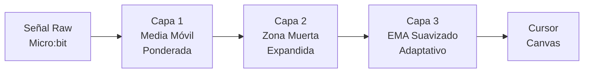

# ✅ Integración Completada: Voz + Filtro Parkinson

## Archivos Creados

| Archivo | Propósito |
|---------|-----------|
| [commands.yaml](file:///c:/Users/Sargas-PC/Desktop/Proyectos/Art-microbit/commands.yaml) | 28 comandos de voz con ~120 aliases fonéticos en español |
| [vosk_server.py](file:///c:/Users/Sargas-PC/Desktop/Proyectos/Art-microbit/vosk_server.py) | Servidor WebSocket Python que procesa audio con Vosk offline |

## Archivos Modificados

| Archivo | Cambios |
|---------|---------|
| [app.js](file:///c:/Users/Sargas-PC/Desktop/Proyectos/Art-microbit/app.js) | +Voice WebSocket client, +Parkinson filter (3 capas), +Command executor |
| [index.html](file:///c:/Users/Sargas-PC/Desktop/Proyectos/Art-microbit/index.html) | +Tarjeta "Comandos de Voz", +Tarjeta "Perfil de Asistencia" |
| [style.css](file:///c:/Users/Sargas-PC/Desktop/Proyectos/Art-microbit/style.css) | +Estilos voice card, parkinson card, animaciones |
| [server.js](file:///c:/Users/Sargas-PC/Desktop/Proyectos/Art-microbit/server.js) | +MIME type .yaml |
| [inicio.bat](file:///c:/Users/Sargas-PC/Desktop/Proyectos/Art-microbit/inicio.bat) | +Verifica Python, instala deps, inicia Vosk en paralelo |

---

## 🎤 Comandos de Voz (commands.yaml)

Organizados por categorías con variantes fonéticas:

- **Colores** (9): rojo, rosa, morado, verde, amarillo, azul, naranja, blanco, negro
- **Pinceles** (8): normal, neón, acuarela, crayón, spray, puntos, estrellas, espejo
- **Funciones** (8): limpiar, calibrar, grosor+/-, emociones on/off, guardar
- **Perfiles** (4): leve, moderado, severo, desactivar filtro

> [!TIP]
> Para agregar nuevos comandos, simplemente edita `commands.yaml` — no necesitas tocar código JavaScript ni Python.

---

## 🩺 Filtro de Temblor Parkinson (3 capas)

| Perfil | Zona Muerta | Suavizado | Descripción |
|--------|-------------|-----------|-------------|
| ⚪ Sin filtro | 10 mg | 0.12 | Comportamiento normal |
| 🟢 Leve | 30 mg | 0.08 | Temblor ligero |
| 🟡 Moderado | 80 mg | 0.05 | Temblor medio |
| 🔴 Severo | 150 mg | 0.03 | Temblor fuerte |
| 🔧 Personalizado | Ajustable | Ajustable | Control total |

---

## 🚀 Cómo Usar

1. Ejecutar `inicio.bat` (inicia ambos servidores automáticamente)
2. En la interfaz:
   - Activar el toggle **"Activar Micrófono"** para comandos de voz
   - Seleccionar un **Perfil de Asistencia** según la condición
   - Usar mouse (Modo Ratón) o Micro:bit como siempre

---

## Dependencias Python Instaladas
- `vosk` 0.3.45 — Motor de reconocimiento de voz offline
- `websockets` 16.0 — Servidor WebSocket async
- `pyyaml` — Parser de archivos YAML
